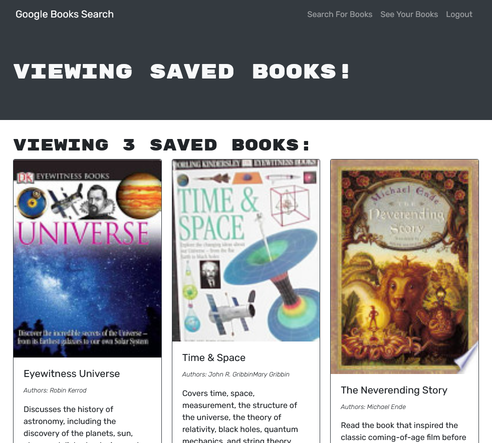

# Book Search Engine

## Description

Search for and save your favorite books with this book search engine created with the MERN stack and the Google Books API.

## Made with
- MongoDB
- Mongoose
- Express
- React
- Node.js
- GraphQL API built with Apollo Server

## Installation

To install necessary dependencies, run the following command:

```
npm i
```

## Usage

Run
```
npm start
```


